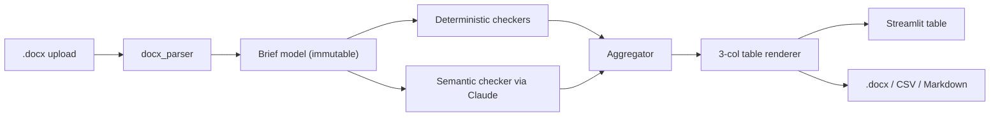

# Vertex Brief Review Agent

An agent that reviews Vertex client briefing `.docx` files for formatting, grammar, and structural compliance against the official 12-section template, and returns the required 3-column feedback table.

Built for the Vertex North America BizOps team to scale brief review through the music festival peak.



## Why this design

The assessment mixes two very different rule types, and the agent treats them differently:

- **Deterministic checks (regex / `python-docx` walks)** for everything verifiable from the bytes: spelling, duplicate words, month/year/deal/dollar/`US`/competitor abbreviations, single space after period, section presence, table column counts, line counts, header icon presence, title format. These are cheap, fast, and 100% reproducible.
- **Semantic checks (Claude Sonnet 4.5 with structured tool output)** for the rules that genuinely require judgment: "proactive talking points with context and intent" (section 9), "expected concern AND suggested response" (section 10), product specificity in "Our Current Business" (section 7), and the substance of each Key Facts subsection (8A, 8B, 8C). One Claude call per rule, with prompt caching on the rule descriptions so repeat reviews stay under ~$0.05 per brief.

Forcing Claude through a single tool definition (`record_findings`) means every response is structured JSON we can validate before it touches the output table. Temperature is pinned to 0 and prompts are deterministic, so the same brief produces the same review every time.

## Quick start (local)

```bash
python3 -m venv .venv
source .venv/bin/activate
pip install -e ".[dev]"
export ANTHROPIC_API_KEY=sk-ant-...
streamlit run streamlit_app.py
```

The app opens at <http://localhost:8501>. Upload any `.docx` brief, or pick one of the built-in demo briefs from the sidebar to see the system in action without your own data.

## Run the tests

```bash
pytest --cov=core
```

40 tests, ~90% line coverage on `core/`. The semantic checker is exercised against a fake LLM client so the suite runs offline in under 2 seconds.

## Deploying the shareable link (Streamlit Community Cloud)

1. **Create a new GitHub repo** and push this directory:

   ```bash
   git init && git add . && git commit -m "feat: initial vertex brief review agent"
   git remote add origin https://github.com/<you>/vertex-brief-review.git
   git push -u origin main
   ```

2. **Connect Streamlit Community Cloud** at <https://share.streamlit.io>, click *New app*, point it at the repo, branch `main`, file `streamlit_app.py`, Python 3.11.

3. **Add the secret**: in the app's *Settings -> Secrets* dialog, paste:

   ```toml
   ANTHROPIC_API_KEY = "sk-ant-..."
   ```

4. **Done.** Streamlit publishes a stable URL like `https://vertex-brief-review.streamlit.app` that you can share with the BizOps team. Re-deploys happen automatically on every push to `main`.

If you'd rather not host it, the same `streamlit run streamlit_app.py` command also works locally and over a tunnel like ngrok.

## What it checks

### Formatting & grammar (deterministic, column 2)

| Rule | Implementation |
|---|---|
| No misspellings | `pyspellchecker` with payments-domain allowlist; hyphenated tokens split before checking |
| No duplicate adjacent words | `\b(\w+)\s+\1\b` with a small allowlist for genuine repeats |
| Months use 3-letter abbrev | flag full month names (`January` -> `Jan`) |
| Years use 4 digits | flag 2-digit years adjacent to a month |
| Deal length follows `X-yr deal` | flag `7 year deal` etc. |
| `United States` -> `US` | flag occurrences (with a small proper-noun allowlist) |
| Don't flag pronoun `us` | rule above only matches the full phrase |
| Dollar abbreviations follow `$100M` | flag `$42 million`, `$42,000,000`, etc. |
| One space after a period | flag double-spaces after `.` |
| Competitor names: `Payments United` -> `PU`, `NewPay` -> `NP` | flag every occurrence of the full name |

### Section structure (deterministic, column 3)

- Section presence in template order; missing sections are still listed and flagged.
- Title format: `[Client Name] Meeting Brief`, capitalize only the first letter of each word.
- 2-column tables for sections 3-7; 4-column attendee table for section 11.
- Line limits per section (one line for sections 3 and 4; two lines for 5 and 6; three lines for Key Facts 8A/8B/8C; two lines for 8D; bullets in 9 and 10 ≤ 3 lines each; bio ≤ 7 lines).
- Bullet counts: ≤ 5 for executive messages, ≤ 3 for client topics.
- Attendee rows must include name, pronunciation, title, form of address, email, photo.
- Header icon must exist in the document header.
- Vertex attendee line follows `[Name], [Title, Team Name]` or states `No other Vertex attendees`.

### Semantic substance (Claude, column 3)

- **Section 7**: deals must name specific products, not vague references.
- **Section 8A**: business overview must be substantive (not generic platitudes).
- **Section 8B**: competition must include share by network, RFPs, or other competitive dynamics.
- **Section 8C**: Vertex overview must include both cards in force AND portfolio size.
- **Section 9**: each bullet must be a proactive talking point with both context and intent.
- **Section 10**: each bullet must include both the expected concern AND a suggested response.
- **Section 11**: each attendee bio must be 1-2 substantive sentences.

## What I would do differently if the constraints lifted (interview discussion)

The 3-column table is fine for archival, but it isn't where the work happens. If we were free to redesign the workflow:

1. **Annotated `.docx` with native Word comments** anchored to the offending text. Sales leads already work in Word; round-tripping a commented file lets them accept/reject inline.
2. **Suggested rewrites, not just flags.** Claude is good at rewriting; today the agent only diagnoses. A two-pass design (diagnose, then rewrite the affected runs) would cut reviewer time meaningfully.
3. **Severity tiers.** Some violations are blockers (missing section); some are nits (single-space-after-period). Surface a "must fix before President sees this" lane.
4. **House-style fine-tuning.** Build a few-shot bank from past human-edited briefs so the semantic checks reflect the BizOps team's actual taste, not just the written rules.
5. **Direct ingestion from SharePoint / Google Drive.** Eliminate the upload step entirely; watch a folder, post a Slack message when a new brief lands.
6. **Slack bot.** Sales leads submit a draft URL or attach a file; the bot responds in-thread with the table. Lower friction than a web UI.
7. **Confidence scores per finding.** Helps the reviewer triage which Claude judgments to trust at a glance.
8. **Weekly "brief style drift" report.** Roll up the most common violations to feed back to sales leads. The biggest leverage is helping them write better briefs, not just catching bad ones.

## Project layout

```
visa-assessment/
  streamlit_app.py            # Streamlit UI
  core/
    models.py                 # immutable pydantic models
    docx_parser.py            # python-docx -> Brief
    pipeline.py               # parse -> check -> aggregate
    checkers/
      formatting.py           # global regex rules (column 2)
      structure.py            # presence, table cols, line counts (column 3)
      header_image.py         # header icon (column 3)
      semantic.py             # Claude-backed checks (column 3)
    llm/
      client.py               # Anthropic wrapper, retries, cache
      prompts.py              # per-rule prompts, tool-use schema
    output/
      aggregator.py           # group findings by section
      renderer.py             # markdown + DataFrame + .docx + CSV
  tests/
    fixtures/builder.py       # synthetic clean and dirty briefs
    test_*.py                 # 40 tests, ~90% coverage
  pyproject.toml
  requirements.txt            # for Streamlit Cloud
  runtime.txt                 # Python 3.11
  .streamlit/config.toml      # theme + upload limits
  .streamlit/secrets.toml.example
```

## Notes on line counting

Word "lines" depend on font, page width, and rendering. The agent estimates lines using `\n` splits plus a fixed 95-character soft-wrap budget. The estimate is shown in every line-limit finding (`"estimated 5"`) so the reviewer can sanity check rather than trust a black box. If the BizOps team uses a non-default page width, this constant is one tunable knob in `core/checkers/structure.py`.

## License

Internal Vertex tool. All rights reserved.
